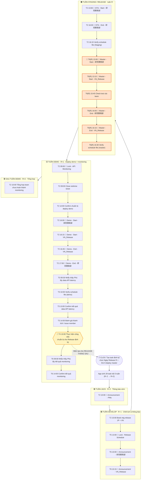

# Flow Release định kỳ — Runbook chi tiết theo dòng thời gian

> Vẽ từ 29 task definitions thật trong DB. Đọc dọc từ trên xuống = đúng thứ tự thực hiện.
> Mốc gốc: **Ngày Release `R` = thứ 6 deploy master**. Các tuần tính theo `R`.

---

## A. Sơ đồ luồng tổng thể (5 tuần)



**Vòng lặp tự nối:** ở tuần Demo (T4) có bộ 3 task *"Tạo target version mới"* · *"Tạo ticket cha (Web /
Mobile)"* · *"Tạo File release schedule"* → đó là tín hiệu quay lại đỉnh sơ đồ, bấm "Tạo task định kỳ"
cho release tháng kế tiếp (đường nét đứt 🔁).

---

## B. Runbook chi tiết — từng step làm gì, khi nào

Ký hiệu: `[T-?]` = thứ trong tuần · giờ là giờ task được đặt · 🧩 = có template ghi chú sẵn.

### 🟦 TUẦN JACK  (R − 2 tuần) — *Thông báo sớm*
| # | Khi nào | Step | Làm gì cụ thể |
|---|---------|------|---------------|
| 1 | T2 · 10:00 🧩 | **Announcement - PMs** | Gửi thông báo lịch release sắp tới cho các PM (dùng nội dung template `Announcement - PMs`). |

### 🟩 TUẦN DEVELOP  (R − 1 tuần) — *Chốt lịch & thông báo các bên*
| # | Khi nào | Step | Làm gì cụ thể |
|---|---------|------|---------------|
| 2 | T2 · 10:00 | **Book mtg release định kỳ JP + VN** | Đặt lịch họp release cho cả 2 phía Nhật và Việt. |
| 3 | T5 · 13:00 🧩 | **Lock - Release Schedule** | Chốt (khoá) file Release Schedule, không cho sửa thêm. |
| 4 | T6 · 10:00 🧩 | **Announcement - 研究開発部** | Thông báo lịch release cho phòng R&D (JP). |
| 5 | T6 · 10:15 🧩 | **Announcement - VN_Release** | Thông báo lịch release cho kênh VN_Release. |

### 🟧 TUẦN STAGING / RELEASE  (tuần chứa R) — *Deploy staging đầu tuần, deploy master ngày R*
| # | Khi nào | Step | Làm gì cụ thể |
|---|---------|------|---------------|
| 6 | T2 · 13:00 🧩 | **STG - Start - 研究開発部** | Báo bắt đầu deploy môi trường **Staging** cho R&D. |
| 7 | T2 · 16:00 🧩 | **STG - End - 研究開発部** | Báo kết thúc deploy Staging cho R&D. |
| 8 | T2 · 16:15 | **Verify release schedule file (Staging)** | Kiểm tra lại file release schedule sau deploy staging. |
| 9 | **T6(R)** · 13:00 🧩 | **Master - Start - 研究開発部** | Báo bắt đầu deploy **Master/Production** cho R&D. |
| 10 | **T6(R)** · 13:15 🧩 | **Master - Start - VN_Release** | Báo bắt đầu deploy Master cho kênh VN. |
| 11 | **T6(R)** · 15:45 | **Check tình hình test của các team** | Rà soát các team đã test xong chưa trước khi đóng. |
| 12 | **T6(R)** · 16:00 🧩 | **Master - End - 研究開発部** | Báo kết thúc deploy Master cho R&D. |
| 13 | **T6(R)** · 16:15 🧩 | **Master - End - VN_Release** | Báo kết thúc deploy Master cho kênh VN. |
| 14 | **T6(R)** · 16:30 | **Verify file release schedule (master)** | Kiểm tra lại file release schedule sau deploy master. |

### 🟨 TUẦN DEMO  (R + 1 tuần) — *Deploy & demo môi trường demo, monitoring, chốt chu kỳ sau*
| # | Khi nào | Step | Làm gì cụ thể |
|---|---------|------|---------------|
| 15 | T2 · 09:00 🧩 | **Lock - API Monitoring** | Khoá file API Monitoring, liệt kê team chưa điền. |
| 16 | T2 · 09:00 | **Close redmine ticket** | Đóng các ticket Redmine của đợt release. |
| 17 | T2 · 14:00 | **Confirm chuẩn bị deploy demo với member** | Xác nhận member đã sẵn sàng deploy môi trường demo. |
| 18 | T2 · 16:00 🧩 | **Demo - Start - 研究開発部** | Báo bắt đầu deploy môi trường **Demo** cho R&D. |
| 19 | T2 · 16:15 🧩 | **Demo - Start - VN_Release** | Báo bắt đầu deploy Demo cho kênh VN. |
| 20 | T2 · 16:45 🧩 | **Demo - End - VN_Release** | Báo kết thúc deploy Demo cho kênh VN. |
| 21 | T2 · 17:00 🧩 | **Demo - End - 研究開発部** | Báo kết thúc deploy Demo cho R&D. |
| 22 | T3 · 09:30 | **Nhắc thầy Phú lấy data API latency** | Nhắc lấy data cho file Theo dõi API latency. |
| 23 | T3 · 10:00 | **Verify file release schedule (demo)** | Kiểm tra file release schedule sau deploy demo. |
| 24 | T3 · 13:00 | **Confirm kết quả data API latency** | Xác nhận đã có kết quả data API latency. |
| 25 | T3 · 14:00 | **Đánh giá thành tích / issue member** | Đánh giá sprint vừa qua của member. |
| 26 | **T4 · 10:00** | **➜ Tạo target version mới** · **Tạo ticket cha (Web / Mobile)** · **Tạo File release schedule** | **Bấm "Tạo task định kỳ" cho release THÁNG SAU** → quay lại đầu flow. |
| 27 | T6 · 09:00 | **Nhắc thầy Phú lấy kết quả monitoring** | Nhắc lấy kết quả monitoring. |
| 28 | T6 · 14:00 | **Confirm kết quả monitoring của thầy Phú** | Xác nhận tình hình lấy kết quả monitoring. |

### 🟥 SAU TUẦN DEMO  (R + 2 tuần) — *Tổng hợp đóng chu kỳ*
| # | Khi nào | Step | Làm gì cụ thể |
|---|---------|------|---------------|
| 29 | T2 · 10:00 | **Tổng hợp team chưa hoàn thành Task monitoring** | Tổng kết các team chưa xong monitoring → đóng chu kỳ. |

---

## C. Lưu ý theo flow

- **Đọc cột "Khi nào" là đủ:** app đã đặt sẵn task đúng ngày/giờ, cowork chỉ cần làm theo task tới hạn.
- **Mỗi task = 1 ô 15 phút**, giờ luôn nằm trong khung **07:30–18:00**.
- **Step 26 là bản lề** nối sang tháng sau — đừng bỏ qua.
- Tạo nhầm ngày → dùng **"Tạo lại"** (xoá sạch task định kỳ tháng đó rồi sinh lại), không sửa tay.
- 🧩 = đã có template; nội dung ghi chú tự điền ngày thật khi tạo. Sửa template thì tạo lại để áp dụng.
```
