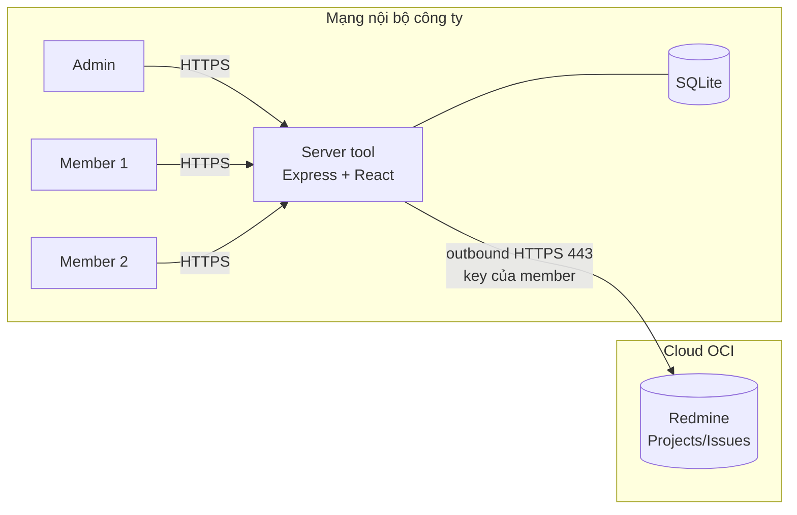
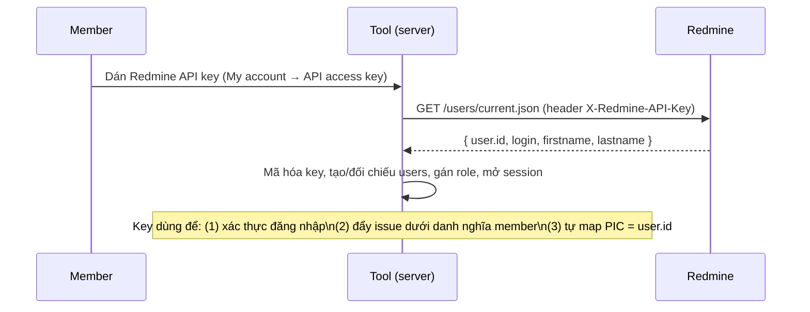
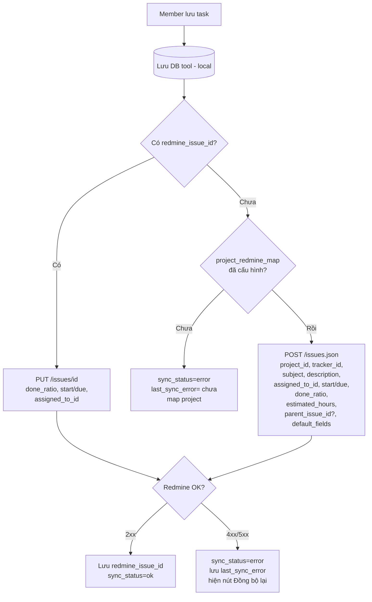
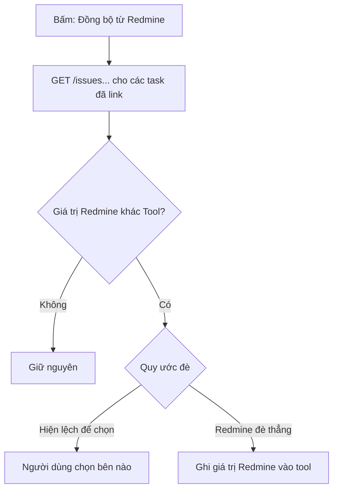

# Thiết kế: Đưa tool dùng cho cả team + Tích hợp Redmine (1 chiều)

> Tài liệu này mô tả cách biến công cụ quản lý task (hiện là tool cá nhân chạy local)
> thành công cụ **dùng chung cho team** cho riêng phần **Quản lý Project**, đồng thời
> **đẩy dữ liệu task lên Redmine** của công ty. Dành cho team kỹ thuật review.
>
> Trạng thái: **BẢN THIẾT KẾ** (chưa code).
> Quyết định đã chốt với chủ sở hữu tool: host **server nội bộ** · đồng bộ **1 chiều
> (tool → Redmine)** · danh tính **mỗi member dùng API key Redmine riêng** · mô hình
> **lai B** (tạo + cập nhật issue từ tool, tự nối cây cha–con) · giữ **SQLite**.

---

## 1. Bối cảnh & mục tiêu

### 1.1. Hiện trạng
- Stack: **Express + node:sqlite + React (Vite)**; đóng gói chạy **1 máy** (Node SEA exe),
  server bind `127.0.0.1`, DB là **1 file SQLite cạnh exe**.
- **Không có khái niệm người dùng** (no auth, no account); ai mở app cũng thấy & sửa
  toàn bộ dữ liệu.
- Module Quản lý Project: `projects` + `project_tasks` (cây 3 cấp, có `tien_do` %,
  ngày dự kiến, `estimate_hours`, `assignee` là **tên PIC dạng chuỗi tự do**).
- Chưa có kết nối Redmine.

### 1.2. Mục tiêu
1. **Module Quản lý Project** dùng được cho **cả team** (nhiều người, đăng nhập, phân quyền).
2. Các module còn lại (task cá nhân, lịch release, báo cáo tuần) **chỉ chủ tool dùng**.
3. Member tạo/cập nhật task (tiến độ, ngày dự kiến, PIC) trên tool → **phản ánh lên Redmine**.

### 1.3. Ngoài phạm vi (Non-goals)
- Đồng bộ **2 chiều TỰ ĐỘNG** (Redmine tự đẩy về tool, real-time) — xem mục Rủi ro & Lộ trình.
  **Lưu ý:** *đọc/lấy về thủ công* từ Redmine thì VẪN làm (nút bấm) — xem **mục 6.5**.
- Thay thế Redmine. Tool là lớp nhập liệu tối giản; Redmine vẫn là hệ thống gốc.
- Mở ra Internet công cộng (chạy trong mạng nội bộ/VPN).

---

## 2. Tổng hợp quyết định kiến trúc & lý do

| # | Quyết định | Lý do chọn | Phương án đã loại / đánh đổi |
|---|------------|------------|------------------------------|
| D1 | **Host: server nội bộ công ty** | Cùng mạng Redmine; dữ liệu nội bộ không ra ngoài; ổn định hơn máy cá nhân | Cloud VM (phải mở mạng tới Redmine); máy văn phòng bật 24/7 (kém ổn định) |
| D2 | **Đồng bộ 1 chiều tool → Redmine** | Đúng nhu cầu; đơn giản; không phải xử lý xung đột | 2 chiều: phức tạp (conflict, webhook/polling) — để Phase sau |
| D3 | **Mỗi member dùng API key Redmine riêng** | Thay đổi hiện đúng tên người trên Redmine; **dùng luôn làm đăng nhập**; **tự map PIC** | 1 tài khoản dịch vụ: mất dấu vết ai làm |
| D4 | **Mô hình lai B (create + update)** | Tạo task con là việc thường xuyên → cần tạo ngay từ tool; tự **nối cây cha–con** | A "chỉ link issue có sẵn": phải lên Redmine tạo tay mỗi lần → bất tiện |
| D5 | **Giữ SQLite** | Team nhỏ, 1 tiến trình server; migration chỉ **cộng thêm** | Postgres: chưa cần; chỉ đổi khi chạm ngưỡng (mục 11) |
| D6 | **Anti-corruption layer (lớp dịch)** | Redmine nhiều trường, tool tối giản → giấu độ phức tạp ở 1 hàm dịch + default | Mirror schema Redmine vào DB: phình DB vô ích |

**Nguyên tắc xuyên suốt:**
- **Local-first**: luôn lưu vào DB tool trước, đẩy Redmine sau → member không bao giờ bị chặn.
- **Tool là nguồn chân lý chỉ cho vài trường nó quản lý** (tiến độ, ngày dự kiến, PIC);
  mọi trường khác để Redmine làm chủ.
- **Độ phức tạp của Redmine = cấu hình 1 lần của admin**, không lọt xuống member.

### 2.1. ⚠️ Làm rõ "1 chiều": là GHI một chiều, KHÔNG phải đọc một chiều

Đây là điểm hay bị hiểu nhầm — cần tách **2 trục độc lập**:

| Trục | Hướng | Cơ chế |
|------|-------|--------|
| **GHI (write)** — thay đổi dữ liệu | **1 chiều: tool → Redmine** | **Tự động** khi member lưu task |
| **ĐỌC (read)** — lấy thông tin về xem/seed | **Cho phép cả 2 phía** | **Thủ công**: bấm nút mới lấy (không real-time) |

- "1 chiều" nghĩa là **tool không bao giờ tự động bị Redmine ghi đè ngược**, **không** có nghĩa "tool không đọc được Redmine".
- Vì vậy tool **vẫn lấy được** task có sẵn / thay đổi mới từ Redmine — nhưng **chỉ khi người dùng bấm** "Import" hoặc "Đồng bộ từ Redmine" (xem mục 6.5). Redmine **không tự đẩy** sang tool.
- Cái ta cố tình tránh là **GHI ngược TỰ ĐỘNG + LIÊN TỤC** (kéo theo bài toán xung đột "cùng 1 trường sửa ở 2 nơi, nghe ai?" + webhook/polling).

> Ví dụ dễ hình dung: tool giống bản **photocopy**. Redmine sửa = bản gốc đổi; tờ copy bên
> tool chỉ đổi khi bạn **"chụp lại"** (bấm đồng bộ). Không bấm thì copy vẫn là bản cũ.

---

## 3. Kiến trúc tổng thể

```
  ┌──────── MẠNG NỘI BỘ CÔNG TY ─────────┐        ┌─────── CLOUD OCI ───────┐
  │ Bạn (admin) ─┐                       │        │                         │
  │ Member 1 ────┼─HTTPS─▶ SERVER TOOL   │        │   REDMINE (OCI)         │
  │ Member 2 ────┘         (nội bộ)      │        │   Projects / Issues     │
  │                        ├─ Auth       │        │                         │
  │                        ├─ REST API   │        │                         │
  │                        ├─ Sync(→)    │        │                         │
  │                        └─ SQLite     │        │                         │
  │                              │        │        │                         │
  └──────────────────────────────┼────────┘        └────────────▲────────────┘
                                  │ outbound HTTPS 443           │
                                  └──────────────────────────────┘
                            (qua Internet hoặc VPN/FastConnect tới OCI;
                             KHÔNG cần chiều ngược OCI→nội bộ vì ghi 1 chiều)
```



### 3.1. Vị trí & mạng (OCI ↔ nội bộ) — điểm cần lưu ý
- **Redmine: trên cloud OCI** · **Server tool: trong mạng nội bộ công ty**.
- Server tool cần **mở egress HTTPS (443)** tới domain/IP của Redmine OCI — qua Internet,
  hoặc kênh riêng **VPN/OCI FastConnect** nếu công ty đã có.
- Nếu Redmine OCI có **IP allowlist** → phải whitelist IP công khai (egress) của mạng nội bộ.
- **Không cần inbound** từ OCI về server nội bộ (do ghi 1 chiều, không webhook) → an toàn,
  không phải mở cổng vào.
- **Độ trễ cao hơn** (gọi qua cloud) → đặt **timeout rộng + retry**; ưu tiên cơ chế đẩy nền
  để không làm chậm thao tác của member.
- TLS: verify chứng chỉ Redmine OCI bình thường.

---

## 4. Mô hình dữ liệu (chỉ THÊM, không đập đi)

> Tất cả là **migration cộng thêm** (ALTER ADD COLUMN / CREATE TABLE), chạy tự động khi
> server khởi động — giống các lần nâng schema trước, **không mất dữ liệu**.

### 4.1. Bảng mới `users`
```sql
CREATE TABLE users (
  id                INTEGER PRIMARY KEY AUTOINCREMENT,
  redmine_user_id   INTEGER UNIQUE,         -- lấy từ /users/current.json
  name              TEXT NOT NULL,
  login             TEXT,                    -- redmine login (tham khảo)
  api_key_encrypted TEXT NOT NULL,          -- API key Redmine, MÃ HÓA (AES-256-GCM)
  role              TEXT NOT NULL DEFAULT 'member', -- 'admin' | 'member'
  active            INTEGER NOT NULL DEFAULT 1,
  created_at        TEXT NOT NULL,
  updated_at        TEXT NOT NULL
);
```

### 4.2. Bảng mới `project_redmine_map` (cấu hình map — admin nhập 1 lần)
```sql
CREATE TABLE project_redmine_map (
  project_id        INTEGER PRIMARY KEY,    -- id project trong tool
  redmine_project_id INTEGER NOT NULL,      -- id/identifier project trên Redmine
  default_tracker_id INTEGER NOT NULL,      -- tracker khi tạo issue
  default_fields    TEXT NOT NULL DEFAULT '{}', -- JSON: giá trị mặc định cho field bắt buộc
  updated_at        TEXT NOT NULL
);
```

### 4.3. Bảng mới `pic_redmine_map` (PIC tên → user Redmine)
```sql
-- assignee trong tool là chuỗi tên ("Định", "Nam"); cần id user Redmine để set assigned_to.
CREATE TABLE pic_redmine_map (
  pic_name         TEXT PRIMARY KEY,        -- khớp với project_tasks.assignee
  redmine_user_id  INTEGER NOT NULL
);
-- Tự điền dần khi member đăng nhập (biết được redmine_user_id của họ),
-- hoặc admin nhập tay cho người chưa từng đăng nhập.
```

### 4.4. Thêm cột vào bảng có sẵn
```sql
ALTER TABLE projects        ADD COLUMN redmine_project_id INTEGER;   -- tiện tra cứu
ALTER TABLE project_tasks   ADD COLUMN redmine_issue_id  INTEGER;    -- issue đã tạo
ALTER TABLE project_tasks   ADD COLUMN sync_status       TEXT DEFAULT 'pending'; -- pending|ok|error
ALTER TABLE project_tasks   ADD COLUMN last_sync_error   TEXT;
ALTER TABLE project_tasks   ADD COLUMN created_by        INTEGER;    -- users.id (truy vết)
ALTER TABLE project_tasks   ADD COLUMN updated_by        INTEGER;

-- Phân tách dữ liệu CÁ NHÂN (chỉ admin thấy): gắn chủ sở hữu.
ALTER TABLE tasks           ADD COLUMN owner_id INTEGER;  -- task cá nhân
-- (tương tự cho các bảng thuộc module cá nhân: schedules, weekly_* … nếu cần)
```
**Các cột cũ giữ nguyên 100%** (`tieu_de`, `tien_do`, `ngay_*`, `assignee`, `estimate_hours`…).

### 4.5. Ràng buộc phân cấp: nâng tool từ 3 → 4 cấp

**Vấn đề:** luật công ty trên Redmine yêu cầu cây **lv1 → lv2 → lv3 → (vô số) lv4**. Tool
hiện chỉ cho **tối đa 3 cấp** (`project_tasks.level CHECK BETWEEN 1 AND 3` + route chặn khi
`parent.level >= 3`). Nếu giữ 3 cấp, cây tool **không khớp** cây Redmine → lv4 (nơi chứa
phần lớn task thực thi) không biểu diễn được.

**Giải pháp:** nâng giới hạn tool lên **4 cấp**. Phạm vi sửa (tất cả nằm trong tool, không
liên quan Redmine):
- **DB**: đổi ràng buộc `level` từ `BETWEEN 1 AND 3` → `1 AND 4`. (SQLite không sửa CHECK
  trực tiếp được → dùng **migration rebuild bảng**: tạo bảng mới, copy dữ liệu, đổi tên —
  đã có sẵn mẫu migration kiểu này trong `db.ts`, không mất dữ liệu.)
- **Backend**: nới điều kiện chặn `parent.level >= 3` → `>= 4`.
- **Frontend**: thêm mức thụt lề cho cấp 4 (hiện đang hardcode 3 mức `0/36/72px` → thêm
  `108px`); logic dựng cây/rollup đã đệ quy nên tự chạy với cấp 4.

> Đây là **việc của tool**, độc lập với Redmine; nên làm **trước/cùng Phase 1**. Có thể cân
> nhắc làm **độ sâu linh hoạt (cấu hình)** thay vì cứng 4, nhưng nếu luật cố định ở 4 thì
> nâng thẳng lên 4 là gọn nhất.

---

## 5. Xác thực & phân quyền

### 5.1. Đăng nhập bằng Redmine API key (1 lần)

- **Session**: cookie httpOnly (hoặc JWT ngắn hạn). Mọi request `/api/**` qua middleware xác thực.
- **1 credential, 3 nhiệm vụ**: đăng nhập + định danh khi đẩy + map PIC.

### 5.2. Phân quyền (RBAC tối giản)
| Vai trò | Quản lý Project | Module cá nhân | Cấu hình map / admin |
|---------|-----------------|----------------|----------------------|
| `admin` (bạn) | ✔ toàn quyền | ✔ | ✔ |
| `member` | ✔ (theo project được phép) | ✘ ẩn | ✘ |

- Dữ liệu cá nhân lọc theo `owner_id = current_user` → member không truy cập được.
- Route Quản lý Project mở cho member; route cá nhân + cấu hình chặn ở middleware theo role.

---

## 6. Luồng đồng bộ Redmine (cốt lõi)

### 6.0. ⭐ Phạm vi dữ liệu: GHI lên vs ĐỌC về (cần nghiên cứu kỹ)

Đây là phần **cần chốt rõ ràng nhất** với team. Chia làm 3 nhóm: tool **ghi lên**, tool
**đọc về**, và **không đụng** (Redmine làm chủ).

#### A) GHI lên Redmine (tool → Redmine) — chiều tự động
| Trường tool | → Redmine | Lúc CREATE | Lúc UPDATE |
|-------------|-----------|:---------:|:----------:|
| `tieu_de` | subject | ✔ | ✘ (để Redmine giữ) |
| `ghi_chu` | description | ✔ | ✘ |
| `project_id` (map) | project_id | ✔ | — |
| (cố định) tracker | tracker_id | ✔ | — |
| `assignee` (PIC) | assigned_to_id | ✔ | ✔ |
| `ngay_bat_dau_du_kien` | start_date | ✔ | ✔ |
| `ngay_ket_thuc_du_kien` | due_date | ✔ | ✔ |
| `tien_do` | done_ratio | ✔ | ✔ |
| `estimate_hours` | estimated_hours | ✔ | ✔ |
| `parent_id` | parent_issue_id | ✔ | (✘) |
| (mặc định) | custom field bắt buộc | ✔ | ✘ |

→ Khi UPDATE chỉ đẩy nhóm **"việc thực thi"**: `done_ratio, start_date, due_date,
assigned_to_id, estimated_hours`. Không ghi đè subject/description.

#### B) ĐỌC về tool (Redmine → tool) — chiều thủ công (Import / Làm mới)
| Redmine | → tool | Khi Import | Khi "Đồng bộ từ Redmine" |
|---------|--------|:---------:|:------------------------:|
| subject | `tieu_de` | ✔ | (tùy chọn) |
| description | `ghi_chu` | ✔ | ✘ (dễ xung đột) |
| done_ratio | `tien_do` | ✔ | ✔ |
| start_date / due_date | ngày dự kiến | ✔ | ✔ |
| assigned_to | `assignee` (map ngược id→tên) | ✔ | ✔ |
| estimated_hours | `estimate_hours` | ✔ | ✔ |
| parent | cây cha–con | ✔ | (✘) |
| issue id | `redmine_issue_id` | ✔ | — |

#### C) KHÔNG đụng tới (Redmine làm chủ hoàn toàn)
`status`, `priority`, `category`, `target version`, watchers, **comment/journal**,
**attachment**, **time entries (log giờ)**, và các custom field không bắt buộc → tool
**không ghi, không kéo về** (trừ khi sau này quyết định hiển thị read-only).

#### ❓ Điểm CẦN NGHIÊN CỨU KỸ (chốt khi review)
1. **`assignee` nhiều người**: tool cho phép PIC dạng "Định, Nam"; Redmine `assigned_to_id`
   **chỉ 1 người/issue**. → Chốt: tool cũng 1 PIC? hay lấy người đầu? hay dùng custom field?
2. **`status` của Redmine**: có cần **đọc về để hiển thị read-only** (vd thấy issue đã
   Closed/Rejected) không? Hiện đang để ngoài phạm vi.
3. **`description`**: chốt **chỉ set lúc tạo**, không đồng bộ 2 chiều (tránh xung đột văn bản dài).
4. **Liên động `done_ratio` ↔ `status`**: một số cấu hình Redmine tự đổi status theo
   done_ratio (hoặc chặn done_ratio theo status/workflow). → Cần kiểm tra cấu hình Redmine OCI.
5. **Custom field bắt buộc**: trường nào, kiểu gì (list/user/date), giá trị mặc định hợp lệ.
6. **Quy ước đè khi "Đồng bộ từ Redmine"** lúc 2 bên lệch (mục 6.5) — chốt: hiện lệch để chọn.

### 6.1. Lưu task → đồng bộ

- **Idempotent**: có `redmine_issue_id` ⇒ UPDATE; chưa có ⇒ CREATE rồi lưu id.
- **Soft-fail + retry**: lỗi không chặn member; task vẫn ở local, đánh dấu để đẩy lại
  (nút thủ công hoặc job nền quét `sync_status='error'`).

### 6.2. Tạo task con → tự nối cây
```
Tool                                   Redmine
Task A (issue #101) ─────────────────▶ Issue #101
  └ tạo Task A.1 (cha A có id 101)
     POST /issues.json {parent_issue_id:101,...}
        └────────────────────────────▶ Issue #205 (con #101)
     lưu redmine_issue_id=205 cho A.1
```

### 6.3. Bảng ánh xạ trường (tool → Redmine)
| Tool | Redmine | Ghi chú |
|------|---------|---------|
| `tieu_de` | `subject` | |
| `ghi_chu` | `description` | (cân nhắc chỉ set lúc CREATE, không ghi đè khi UPDATE) |
| `project_id` | `project_id` | qua `project_redmine_map` |
| (cố định) | `tracker_id` | `default_tracker_id` |
| `assignee` (tên) | `assigned_to_id` | qua `pic_redmine_map` (id người **được giao**, khác người **thực hiện call**) |
| `ngay_bat_dau_du_kien` | `start_date` | |
| `ngay_ket_thuc_du_kien` | `due_date` | |
| `tien_do` | `done_ratio` | 0–100 trực tiếp |
| `estimate_hours` | `estimated_hours` | |
| `parent_id` (tool) | `parent_issue_id` | = `redmine_issue_id` của task cha |
| — | custom field bắt buộc | lấy từ `default_fields` (JSON) |

> **Phân biệt quan trọng:** *người thực hiện thay đổi* = chủ API key gọi request (member
> đang đăng nhập). *Người được giao* (`assigned_to_id`) = giá trị PIC của task, tra từ
> `pic_redmine_map`. Hai cái độc lập.

### 6.4. Trường tool được phép ghi đè trên Redmine
Khuyến nghị **chỉ** đẩy khi UPDATE: `done_ratio`, `start_date`, `due_date`, `assigned_to_id`,
`estimated_hours`. **Không** ghi đè `subject`/`description`/`status`/`priority` (để Redmine
làm chủ) → giảm tối đa va chạm với người sửa trực tiếp trên Redmine.

### 6.5. Đồng bộ TỪ Redmine về tool (ĐỌC thủ công) — Import & Làm mới

Đây là chiều **đọc**, **không phá vỡ** mô hình ghi-1-chiều (xem mục 2.1). Tất cả đều do
người dùng **chủ động bấm**, không tự động.

**(a) Import / Link task có sẵn từ Redmine** — đưa issue đã tồn tại vào tool:
- *Từng issue*: dán **ID hoặc URL** → `GET /issues/{id}` → tạo task đã gắn `redmine_issue_id`
  (hiện tiêu đề để xác nhận đúng issue).
- *Hàng loạt*: `GET /issues.json?project_id=&assigned_to_id=&status_id=open` → hiện danh
  sách → tick chọn issue cần kéo về.
- Sau import: task hoạt động như mọi task khác; sửa ở tool → đẩy ngược (vẫn 1 chiều ghi).

**(b) Nút "Đồng bộ từ Redmine"** — làm mới giá trị các task đã link:
- Phạm vi: cả project (mọi task có `redmine_issue_id`) hoặc từng task.
- Trường lấy về (map NGƯỢC): `subject→tieu_de`, `done_ratio→tien_do`, `start/due→ngày`,
  `assigned_to→assignee` (tra ngược `redmine_user_id`→tên PIC), `parent→cây` (nếu cha đã import).

**Quy ước "ai đè ai" khi giá trị 2 bên lệch** (PHẢI chốt — xem mục 12):
- **Khuyến nghị: hiện chỗ lệch để người dùng chọn** ("Redmine: 80% / Tool: 50%") → an toàn,
  không mất thay đổi chưa đẩy ở tool.
- Phương án nhanh: Redmine đè thẳng lên tool (rủi ro mất sửa đổi local chưa kịp đẩy).



> Lưu ý: đây vẫn **không phải** đồng bộ 2 chiều tự động. Redmine **không tự đẩy**; chỉ khi
> bấm nút tool mới ĐỌC về. Muốn tự động real-time mới cần webhook/polling + xử lý xung đột
> (Phase sau).

---

## 7. Chi tiết tích hợp Redmine API

- Base URL: `https://<redmine-cong-ty>/`. Header xác thực: `X-Redmine-API-Key: <key>`.
- Endpoint dùng:
  - `GET /users/current.json` — xác thực + lấy user id.
  - `GET /projects.json`, `GET /trackers.json` — admin cấu hình map (chọn project/tracker).
  - `POST /issues.json` — tạo issue.
  - `PUT /issues/{id}.json` — cập nhật.
  - `GET /issues/{id}.json` — verify khi link issue có sẵn; làm mới 1 task.
  - `GET /issues.json?project_id=&assigned_to_id=&status_id=open&include=...` — import hàng loạt / làm mới cả project (đọc, mục 6.5).
- Ví dụ payload tạo:
```json
POST /issues.json
{ "issue": {
  "project_id": 42, "tracker_id": 4,
  "subject": "Cấu hình deployments Cloud Run",
  "assigned_to_id": 17,
  "start_date": "2026-06-08", "due_date": "2026-06-12",
  "done_ratio": 50, "estimated_hours": 8,
  "parent_issue_id": 101
}}
```
- **Xử lý lỗi**: `422` → đọc danh sách field thiếu, bổ sung `default_fields`, retry.
  `401/403` → key sai/không đủ quyền (báo member). `5xx`/timeout → retry sau.
- **Rate limit / chùm cập nhật**: gộp hoặc nối tiếp; tránh bắn quá nhiều request 1 lúc.

---

## 8. Bảo mật

- **API key của member** là dữ liệu nhạy cảm:
  - Mã hóa **at rest** (AES-256-GCM), khóa nằm trong `ENCRYPTION_KEY` (env, không commit).
  - Truyền qua **HTTPS** (reverse proxy nội bộ + TLS).
  - Mỗi key chỉ có **đúng quyền của member đó** trên Redmine → **không leo thang quyền**.
- Session cookie `httpOnly`, `Secure`, `SameSite`.
- Không log API key / không trả key về client sau khi lưu.
- Chạy trong mạng nội bộ/VPN; không expose ra Internet.

---

## 9. Triển khai (deployment)

- **Server tool**: 1 VM/máy **nội bộ công ty** (Linux khuyến nghị); cài **Node 24** (hoặc Docker).
  Redmine **không** cùng mạng — nằm trên **cloud OCI** (xem mục 3.1).
- **Mạng tới Redmine OCI**: mở **egress HTTPS 443** từ server tool ra Redmine OCI (Internet
  hoặc VPN/FastConnect); nếu Redmine OCI bật **IP allowlist** thì whitelist IP egress công ty.
  Không cần mở inbound.
- **Chạy như dịch vụ**: `systemd` / `pm2` / Docker — tự khởi động lại; bind `0.0.0.0`.
- **Reverse proxy + HTTPS**: nginx/Caddy, cấp chứng chỉ nội bộ (cho truy cập của team).
- **Cấu hình qua ENV**:
  ```
  PORT=4000
  DB_PATH=/var/lib/tool/tasks.sqlite
  REDMINE_URL=https://<redmine-tren-OCI>/
  REDMINE_TIMEOUT_MS=15000        # độ trễ cloud → để rộng
  ENCRYPTION_KEY=<chuỗi bí mật 32 byte>
  ```
- **Migration**: chạy tự động lúc khởi động (đã có sẵn cơ chế trong `db.ts`).
- **Backup**: cron sao lưu file SQLite định kỳ (vd mỗi giờ/ngày) + giữ nhiều bản.
- **Khác biệt then chốt so với hiện tại**: bỏ mô hình exe-mỗi-máy; còn **1 DB duy nhất trên server**.

---

## 10. Lộ trình (phân phase, giao được từng phần)

| Phase | Nội dung | Kết quả |
|-------|----------|---------|
| **0** | Chốt quyết định + thu thập thông tin Redmine (mục 12) | Sẵn sàng làm |
| **1** | **Nâng tool lên 4 cấp** (mục 4.5) + chuyển sang **server chung** + **đăng nhập (Redmine key)** + **phân quyền** (chưa sync) | Cây khớp Redmine; team dùng được Quản lý Project; phần cá nhân riêng admin |
| **2** | **Đồng bộ GHI 1 chiều**: tạo/cập nhật issue, map project + PIC, nối cây, retry | Thay đổi ở tool phản ánh lên Redmine |
| **2b** | **Đọc về**: Import / Link issue có sẵn + nút "Đồng bộ từ Redmine" (mục 6.5) | Kéo được task có sẵn trên Redmine vào tool |
| **3** (tùy chọn) | Job retry nền, dashboard trạng thái sync, (xa hơn) 2 chiều tự động | Vận hành mượt hơn |

---

## 11. Rủi ro & hạn chế đã biết

1. **GHI 1 chiều ⇒ tool không TỰ ĐỘNG thấy thay đổi từ Redmine.** Sửa trực tiếp trên
   Redmine ở các trường tool quản lý sẽ bị **lần đẩy sau ghi đè**. Giảm nhẹ: quy ước "nhập
   ở tool"; và dùng **nút "Đồng bộ từ Redmine" (mục 6.5)** để kéo về thủ công khi cần
   (đây là ĐỌC, không phải 2 chiều tự động).
2. **SQLite = 1 tiến trình.** Hợp team nhỏ. Ngưỡng nên chuyển Postgres: ghi đồng thời lớn,
   cần nhiều instance/HA. Khi đó chỉ đổi lớp truy cập DB, **không đập schema**.
3. **Phụ thuộc cấu hình map của admin.** Quên map project/tracker ⇒ task không đẩy được
   (đã có `sync_status=error` cảnh báo, không mất dữ liệu).
4. **Lệ thuộc Redmine API ổn định + quyền của key.** Key thiếu quyền/đổi mật khẩu ⇒ lỗi
   401/403 (báo member cập nhật key).
5. **PIC chưa từng đăng nhập** ⇒ chưa có `redmine_user_id` ⇒ admin nhập tay vào `pic_redmine_map`.
6. **Phụ thuộc kết nối nội bộ → OCI.** Redmine trên cloud nên đường mạng/độ trễ/đứt kết nối
   ảnh hưởng việc đẩy. Giảm nhẹ: local-first + hàng đợi retry (`sync_status=error`); thao
   tác của member ở tool không bị chặn dù OCI tạm thời không tới được.

---

## 12. Cần chuẩn bị (checklist)

**Hạ tầng (IT):**
- [ ] 1 server **nội bộ** (Node 24/Docker); URL nội bộ + HTTPS cho team truy cập.
- [ ] **Mở egress HTTPS 443** từ server nội bộ → **Redmine trên OCI** (Internet hoặc VPN/FastConnect).
- [ ] Nếu Redmine OCI có **IP allowlist** → whitelist IP egress công ty.
- [ ] Kiểm tra **độ trễ/độ ổn định** kết nối nội bộ → OCI (đặt timeout/retry phù hợp).
- [ ] Cron backup file SQLite.

**Từ Redmine admin:**
- [ ] Bật **REST API** (Administration → Settings → API).
- [ ] Mỗi member tự lấy **API key** (My account).
- [ ] **Project id/identifier** trên Redmine ứng với từng project trong tool.
- [ ] **Tracker** mặc định để tạo issue (Task/Feature…).
- [ ] Danh sách **custom field bắt buộc** (nếu có) + giá trị mặc định mong muốn.
- [ ] Đảm bảo key member đủ quyền **tạo/sửa/gán issue** trong các project đó.

**Quyết định còn mở:**
- [ ] UPDATE có ghi đè `subject`/`description` không (khuyến nghị: không).
- [ ] **Quy ước đè khi "Đồng bộ từ Redmine"** lúc 2 bên lệch (khuyến nghị: hiện lệch để chọn — mục 6.5).
- [ ] Chính sách khi xóa task ở tool (đóng issue? bỏ link? — khuyến nghị: chỉ bỏ link, không xóa issue).
- [ ] Cơ chế quản lý `ENCRYPTION_KEY` (ai giữ, đổi khóa thế nào).
- [ ] Số cấp: nâng cứng lên **4** (theo luật công ty) hay làm **độ sâu linh hoạt** (mục 4.5).

---

## 13. Phụ lục — 3 câu hỏi mapping cần trả lời để khóa thiết kế chi tiết
1. Mỗi project trong tool map vào **project Redmine nào** (id/identifier)?
2. Issue tạo từ tool dùng **tracker** gì? Có **custom field bắt buộc** nào (tên + giá trị mặc định)?
3. Cây **4 cấp** của tool (sau khi nâng — mục 4.5) map thẳng thành **parent/child issue** 4 cấp trên Redmine — xác nhận?
