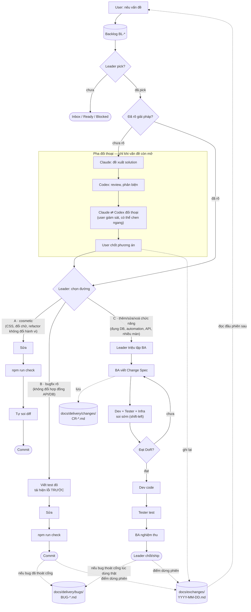

# Team Operating Standard — Task Manager

> Lớp "ô dù" **nối BA · Dev · Tester · Infra · Leader** thành một cách làm việc chung: một nguồn chân lý,
> bàn giao có hợp đồng (chống hiểu sai ý nhau), và nhịp để mỗi vai trò **tự sở hữu & tiến hóa chuẩn của mình**.
> Đây cũng là **quy chuẩn làm việc của chính Leader**.
> Nguồn: các standard trong thư mục này + [docs-standard.md](docs-standard.md). Ai cũng nên đọc file này **trước tiên**.

---

## 0. TL;DR (mọi vai trò)

0. **Quy trình chuẩn (mục 5):** mọi việc vào **backlog do Leader sở hữu** → refine → Leader pick → chọn đường A/B/C. Đường C đi qua BA → Dev + Tester + Infra soi sớm → code/test → BA nghiệm thu → Leader chốt. Leader **quản lý ưu tiên và giám sát mọi cổng**.
1. **Nói bằng artifact, không nói miệng.** Thỏa thuận nào không nằm trong tài liệu (backlog/Change Spec/spec/test/commit) coi như **chưa thỏa thuận**.
2. **Một nguồn chân lý**: code là sự thật; `docs/` là bản mô tả canonical. Lệch → sửa trong cùng lần giao.
3. **Mỗi vai trò có 1 cổng vào (DoR) và 1 cổng ra (DoD)**; không đẩy việc dở sang người sau.
4. **Bất đồng → đưa về artifact + tiêu chí đo được**; không quyết bằng cảm tính. Không ngã ngũ → Leader chốt và ghi lại lý do (ADR).
5. **Mỗi vai trò sở hữu standard của mình** và giữ nó sống; Leader đốc thúc, không viết hộ mãi.

---

## 1. Nguyên tắc vận hành

1. **Artifact-driven**: giao tiếp chủ yếu **bất đồng bộ qua tài liệu** (spec, test, commit, ADR) — vừa là "hợp đồng", vừa tránh tam sao thất bản.
2. **Định nghĩa chung trước, tranh luận sau**: dùng chung **Glossary** (mục 4) để cùng một từ hiểu cùng một nghĩa.
3. **Cổng rõ ràng giữa các khâu**: mỗi bàn giao có *đầu ra kỳ vọng* + *tiêu chí chấp nhận* (mục 6). Không có "chắc ý anh là…".
4. **Nhỏ, thường xuyên, khép vòng**: thay đổi nhỏ, review nhanh, cập nhật docs ngay — hơn là gộp lớn rồi lệch.
5. **Người gần việc nhất quyết định**; việc xuyên vai trò/không ngã ngũ mới leo lên Leader.
6. **Chuẩn phục vụ sản phẩm, không phải nghi lễ**: thấy chuẩn cản trở việc nhỏ → tinh gọn ngay, ghi lý do.

---

## 2. Bản đồ vai trò & standard sở hữu

| Vai trò | Chịu trách nhiệm chính | Sở hữu standard | Artifact đầu ra |
|---|---|---|---|
| **BA** | Vấn đề, phạm vi, giá trị, FR/AC | [design-standard](design-standard.md), specs [01](../specs/01-product-requirement-spec.md)/[02](../specs/02-screen-design-user-flow.md) | Change Spec (`changes/CR-*.md`) |
| **Dev** | Thiết kế kỹ thuật, code, contract | rules [03](../specs/03-api-business-logic-spec.md)/[04](../specs/04-database-design.md)/[06](../rules/06-rules-frontend.md)/[07](../rules/07-rules-backend.md)/[08](../rules/08-rules-database.md), [performance-standard](performance-standard.md) | Code + PR + cập nhật specs |
| **Tester/QA** | Chất lượng, tái hiện bug, nghiệm thu | [qa-standard](qa-standard.md), [testing-strategy](testing-strategy.md), [05](../specs/05-test-acceptance-criteria.md) | Test + kết quả nghiệm thu theo AC |
| **Infra** | Tài nguyên, bảo mật, đóng gói, vận hành | [security-standard](security-standard.md), [performance-standard](performance-standard.md), [09](../rules/09-non-functional-requirements.md) | Cổng review security/perf |
| **Leader** | Kết nối, khơi thông, chốt tranh chấp, giữ chuẩn sống | **team-operating-standard (này)** + [docs-standard](docs-standard.md) | ADR, ownership register, nhịp review |

> Trong nhóm nhỏ / một người kiêm nhiều vai: **vẫn đi qua đủ các cổng** (mục 6) — đội "mũ" nào thì áp cổng của vai đó.

---

## 3. Một nguồn chân lý (chống "mỗi người một bản")

- **Code** = sự thật hành vi. **`docs/`** = mô tả canonical. **Backlog** = việc chưa làm + ưu tiên.
  **Change Spec** = delta đã được pick và đang giao.
- Thứ tự tin cậy khi xung đột hành vi: Code → docs canonical (`01–09`, `standards/`) → Change Spec → trí nhớ
  (không tính). Thứ tự ưu tiên công việc chỉ lấy từ [backlog](../backlog/README.md).
- Quy tắc vàng: *"Nếu không có trong artifact thì chưa được chốt."* Trao đổi miệng phải kết lại bằng 1 dòng trong spec/PR/ADR.

---

## 4. Glossary — cùng từ, cùng nghĩa (chống hiểu sai)

| Thuật ngữ | Nghĩa thống nhất |
|---|---|
| **Change Spec (CR)** | Tài liệu delta cho 1 thay đổi (thêm/sửa/xóa) — [design-standard](design-standard.md) |
| **Backlog item (`BL-*`)** | Bản ghi ngắn về việc chưa làm: vấn đề, giá trị/rủi ro, ưu tiên, trạng thái và bước tiếp theo; không chứa thiết kế/FR/AC |
| **Picked** | Leader đã quyết định bắt đầu item và cấp chỗ trong WIP; chỉ từ đây mới chọn đường A/B/C và mở CR/BUG khi cần |
| **FR** | Yêu cầu chức năng, đánh số, kiểm được |
| **AC** | Tiêu chí nghiệm thu (Given/When/Then), mỗi AC map ≥1 test |
| **DoR** | Definition of Ready — đủ điều kiện để **bắt đầu** một khâu |
| **DoD** | Definition of Done — đủ điều kiện để **kết thúc** một khâu |
| **Canonical** | Bản chính thức (`docs/`); khác *granular gốc* (`instroduction/`) |
| **Baseline** | Ràng buộc không được phá (security/perf) |
| **Budget** | Ngân sách tài nguyên định lượng (bundle, DB, timeout) |
| **ADR** | Bản ghi quyết định kiến trúc/quy trình + lý do (mục 8) |
| **Lần giao** | Một commit (hoặc chuỗi commit) landing cùng nhau trên `main`. **Dự án này không dùng Pull Request** — xem [ADR-P1](#adr-p1--không-dùng-pull-request-merge-thẳng-main). Chỗ nào chuẩn viết *"trong cùng lần giao"* nghĩa là: code + test + docs đi chung, không tách ra để nợ lại |
| **Vùng nhạy cảm** | Secret, spawn/AI, serve file, import, SQL động, đóng gói, endpoint mới |
| **Bug thoát cổng** | Lỗi lọt qua được các cổng ①–⑧, phát hiện sau nghiệm thu / lúc dùng thật. Phải mở hồ sơ `BUG-*` — [delivery/README §2](../delivery/README.md) |
| **LESSON (`L-*`)** | Sai lệch quy trình **không** thành bug (AC đặt sai, docs lệch code, cổng không tồn tại). Ghi một dòng ở [delivery/README §5b](../delivery/README.md) |
| **RC (Root Cause)** | Mã phân loại nguyên nhân gốc của bug (RC-REQ/SPEC/IMPL/TEST/…), mỗi mã trỏ tới standard chịu trách nhiệm — [delivery/README §3](../delivery/README.md) |

> Thấy một từ bị hiểu hai kiểu → **thêm vào bảng này** ngay (đó chính là gốc của hiểu lầm).

---

## 5. Quy trình chuẩn khi bắt đầu một việc (Standard Delivery Flow) — TOÀN TEAM THẤM NHUẦN

> **Mantra:** *"Mọi việc vào backlog → Leader pick → chọn đúng đường → chỉ đóng khi đủ bằng chứng của đường đó."*

**Điểm vào DUY NHẤT:** người cần việc gọi **Leader**: "tôi cần làm X". Leader ghi nhận/chống trùng trong
[backlog canonical](../backlog/README.md), refine và quyết định `Ready`/ưu tiên. Chỉ item `Picked` mới được bắt
đầu delivery; yêu cầu làm ngay có thể được ghi + pick trong cùng lượt. Leader sau đó **chọn đường đi** và giám
sát nó chạy đúng.

### 5.0. Backlog gate và chọn đường: KHÔNG phải việc nào cũng đi full flow

Trước khi phân loại, Leader xác nhận item đã `Picked`. Backlog giữ *tại sao/khi nào làm*; CR/BUG giữ *làm và
kiểm chứng thế nào*. Việc mới ngoài phạm vi quay về backlog, không tự kéo dài CR. Sau đó chọn một trong ba đường:

| Đường | Áp dụng cho | Đi qua những gì |
|---|---|---|
| **A — Nhanh** | Cosmetic: CSS, đổi chữ, đổi nhãn, refactor nội bộ **không đổi hành vi** | Sửa → `npm run check` xanh → tự soi diff → commit. **Không CR, không triệu tập vai nào.** |
| **B — Bugfix** | Lỗi rõ ràng, không đổi hợp đồng API/DB | **Test đỏ tái hiện TRƯỚC** ([qa-standard §3](qa-standard.md)) → sửa → `npm run check` → commit. Không CR. Nếu bug **đã thoát cổng** ⇒ thêm hồ sơ `BUG-*` ([delivery §2](../delivery/README.md)) |
| **C — Full flow** | **Thêm / sửa / xoá chức năng**; đụng DB, automation, hợp đồng API, nhiều màn | Toàn bộ 11 bước + 8 cổng bên dưới. Mức **Lớn** ⇒ Leader ngồi cùng BA (bước 2) + cần người thứ hai duyệt |

**Câu hỏi phân loại** (từ [design-standard §3](design-standard.md)):
*"Thay đổi này có làm ai đó phải học lại cách dùng, hay có thể làm hỏng dữ liệu / chức năng khác không?"*
— **Có** ⇒ đường C. Phân vân giữa B và C ⇒ chọn C.

> **Đường A và B không phải là "bỏ cổng".** Chúng vẫn qua cổng chất lượng (`npm run check`, test, tự soi
> diff, cập nhật docs liên quan). Cái được bỏ là *thủ tục thiết kế* — thứ không tạo giá trị cho một thay
> đổi hai dòng. Chuẩn phục vụ sản phẩm, không phải nghi lễ ([§1.6](#1-nguyên-tắc-vận-hành)).

### 5.0.1. Sơ đồ tổng luồng

Khi vấn đề **còn mở** (chưa rõ giải pháp), chạy pha đối thoại Claude ⇄ Codex trong `docs/exchanges/`
trước khi Leader chọn đường — xem [CLAUDE.md](../../CLAUDE.md). Toàn bộ luồng từ lúc nêu vấn đề tới lúc
ship, gộp cả 3 đường A/B/C:

Mũi tên đặc = luồng thực thi bắt buộc. Mũi tên chấm = ghi vào hồ sơ / đọc lại. Vòng `T2 → T3 → T4 → T2`
là BA tinh chỉnh Change Spec tới khi đạt DoR — không giới hạn số lần. Chi tiết từng bước đường C ở §5.1
ngay dưới đây (bao gồm sơ đồ vai trò riêng).

### 5.1. Đường C — Standard Delivery Flow (đầy đủ)

**Các bước thực thi (11 bước, thứ tự, checklist từng vai)** đã chuyển sang skill
[`.claude/skills/delivery-flow/SKILL.md`](../../.claude/skills/delivery-flow/SKILL.md) — đó là **nguồn
thật duy nhất** cho phần "làm thế nào", để tránh 2 bản trùng nhau lệch dần. File này chỉ giữ phần
governance: nguyên tắc bất di bất dịch, RACI (mục 7), hợp đồng bàn giao (mục 6).

**Nguyên tắc bất di bất dịch của flow này:**
- **Đã chọn đường C thì không bỏ bước, không đảo bước.** Đặc biệt: **Tester và Infra phải** có mặt ở bước 5–6 (không đợi Tester tới bước 9, không đợi Infra tới lúc review cuối). *Đường A/B không áp dụng mục này — chúng có bộ cổng riêng ở [§5.0](#50-backlog-gate-và-chọn-đường-không-phải-việc-nào-cũng-đi-full-flow).*
- **Không "sửa ngầm"**: không đạt cổng → trả về đúng khâu kèm lý do **bằng artifact**.
- **BA là người nghiệm thu cuối** (đối chiếu yêu cầu gốc); Tester *chạy test*, BA *xác nhận đạt yêu cầu*.
- **Leader giám sát mọi cổng** (mục 10): thiếu artifact, bỏ cổng, bàn giao mập mờ, gạt Tester khỏi bước sớm → Leader can thiệp.

---

## 6. Hợp đồng bàn giao (cổng vào/ra) — trái tim của chống-hiểu-sai

| Cổng | Người giao → nhận | Đầu ra kỳ vọng | Cổng chấp nhận |
|---|---|---|---|
| **① Yêu cầu** | Backlog item `Picked` · Người cần việc → Leader → BA | Mô tả việc cần làm + giá trị/ưu tiên | BA hỏi lại tới khi **hiểu đúng vấn đề** |
| **② Thiết kế để review** | BA → **Dev + Tester + Infra** | Change Spec (draft) | Dev+Tester+Infra đọc được, đủ để feedback |
| **③ Feedback → tinh chỉnh** | Dev + Tester + Infra → BA | Feedback *khả thi* (Dev) + *khả-test/AC đủ* (Tester) + *an toàn/tài nguyên* (Infra) | BA cập nhật; Change Spec đạt **DoR** (mọi bên gật) |
| **④ Bàn giao để code** | BA → Dev | Change Spec đạt DoR ([design-standard §4](design-standard.md)) | Nền build+test xanh; Dev bắt đầu code |
| **⑤ Bàn giao để test** | Dev → Tester | Commit trên nhánh + test của Dev + specs cập nhật | Build+test xanh; **đã tự soi `git diff` toàn bộ thay đổi**; commit message ghi `Ref: CR-… (FR-x)` + cách thử. Không dùng PR — [ADR-P1](#adr-p1--không-dùng-pull-request-merge-thẳng-main) |
| **⑥ Cổng hạ tầng** | Infra review | [security §9](security-standard.md) + [performance §6](performance-standard.md) | Không phá baseline; trong budget; nợ được ghi |
| **⑦ Nghiệm thu** | Tester → **BA** | Kết quả chạy qua **từng AC** + ca lỗi/biên | BA xác nhận **đạt yêu cầu gốc**; bug đã có test tái hiện |
| **⑧ Chốt & ship** | BA → Leader → **người dùng** | Docs `01–09` cập nhật, CR → "Đã nghiệm thu" | Không nợ doc; quyết định phát sinh có ADR. (Trước 24/09 cổng này còn bắt buộc `npm run package` + bật lại `TaskManager.exe` mỗi lần đụng `server/`/`src/` — `L-009` — Leader đã chủ động bỏ, xem [delivery/README.md §5b cập nhật 2026-09-24](../delivery/README.md#5b-sổ-sai-lệch--bài-học-lesson)) |

**Quy tắc bàn giao:** mỗi lần giao đính kèm *artifact* + *một câu tóm tắt "cái này làm gì, kiểm thế nào"*. Người nhận **xác nhận hiểu** (tick cổng) trước khi bắt đầu.

---

## 7. RACI cho các hoạt động chính

| Hoạt động | BA | Dev | Tester | Infra | Leader |
|---|---|---|---|---|---|
| Quản lý backlog, ưu tiên, pick và WIP | C | C | C | C | **R/A** |
| Viết Change Spec (FR/AC) | **R/A** | C | C | C | I |
| Feedback thiết kế sớm (khả thi / khả-test / an toàn-tài nguyên) | A | **R** | **R** | **R** | I |
| Thiết kế kỹ thuật & code | I | **R/A** | I | C | I |
| Viết & chạy test | C | C | **R/A** | I | I |
| **Nghiệm thu theo yêu cầu gốc + AC** | **R/A** | I | C | I | I |
| Review security/perf | I | C | I | **R/A** | I |
| Cập nhật docs canonical | C | **R** | C | C | **A** |
| **Giám sát quy trình đúng flow** | I | I | I | I | **R/A** |
| Chốt tranh chấp / ưu tiên | C | C | C | C | **R/A** |
| Giữ standard sống (mỗi bộ) | R(own) | R(own) | R(own) | R(own) | **A** |

*R=làm, A=chịu trách nhiệm cuối, C=hỏi ý, I=được thông báo.*

---

## 8. Giao tiếp & ra quyết định

- **Bất đồng bộ, qua artifact** là mặc định. Họp chỉ khi cần gỡ vướng nhanh — **kết luận họp phải viết lại vào artifact**, nếu không coi như không có.
- **Bất đồng kỹ thuật**: quy về *tiêu chí đo được* (số liệu, test, budget). Ai đề xuất thì nêu đánh đổi. Không ngã ngũ trong thời gian hợp lý → **Leader chốt**.
- **ADR (Architecture/Agreement Decision Record)**: mọi quyết định có ảnh hưởng dài hạn (chọn công nghệ, đổi quy trình, chấp nhận nợ) ghi 1 file ngắn ở `docs/delivery/changes/` hoặc mục "Quyết định" trong CR: *bối cảnh → lựa chọn → lý do → hệ quả*. Để sau này không cãi lại từ đầu.
- **Ngôn ngữ**: tài liệu & commit message bằng tiếng Việt (thống nhất), thuật ngữ kỹ thuật giữ nguyên gốc.

### ADR-P1 — Không dùng Pull Request, merge thẳng `main`

*Bối cảnh:* [team-operating §6](#6-hợp-đồng-bàn-giao-cổng-vàora--trái-tim-của-chống-hiểu-sai) cổng ⑤ từng
ghi *"Dev → Tester: **PR** + test"*. Kiểm tra thực tế (2026-08-01): **15/15 commit gần nhất đi thẳng
`main`, không một merge commit nào** — cổng ⑤ chưa từng tồn tại. Chuẩn mô tả một cơ chế không có thật
([L-004](../delivery/README.md)).

*Lựa chọn:* **bỏ PR**, merge thẳng `main`.

*Lý do:* đây là tool **cá nhân, một người**. PR tồn tại để một người **khác** đọc diff trước khi nó vào
nhánh chính. Không có người thứ hai thì PR chỉ còn phần nghi lễ: tự mở, tự approve, tự merge — tốn thao
tác mà không thêm một con mắt nào. Giữ nó lại là đúng cái *"chuẩn phục vụ sản phẩm, không phải nghi lễ"*
([§1.6](#1-nguyên-tắc-vận-hành)) cấm.

*Nhưng KHÔNG bỏ thứ PR thực sự mang lại* — **một điểm dừng bắt buộc để đọc lại toàn bộ thay đổi**.
Thay bằng cơ chế rẻ hơn, giữ nguyên tác dụng:

| PR mang lại | Thay bằng |
|---|---|
| Một điểm dừng để đọc diff | **Tự soi `git diff --staged` trước mỗi commit** — đọc như review code người khác (mục 9) |
| Mô tả thay đổi có ngữ cảnh | **Commit message** ghi `Ref: CR-… (FR-x)`, lý do, và cách thử ([design-standard §11](design-standard.md)) |
| Cổng chặn khi test đỏ | `npm test` + `npm run build` xanh **trước** khi commit ([qa-standard §2](qa-standard.md)) |
| Lịch sử vì sao thay đổi | `docs/delivery/changes/CR-*.md` — chi tiết hơn mô tả PR nhiều |

*Hệ quả:* mất lớp bảo vệ của branch protection. Vá bằng **cổng chạy tại máy** — xem
[ADR-P2](#adr-p2--cổng-chất-lượng-chạy-tại-máy-npm-run-check--pre-push-hook).

*Xem lại khi:* có người thứ hai tham gia repo. Lúc đó PR có người đọc thật ⇒ đảo lại quyết định này.

### ADR-P2 — Cổng chất lượng chạy tại máy (`npm run check` + pre-push hook)

*Bối cảnh:* [Definition of Done](../../CLAUDE.md) có 5–6 mục **máy kiểm được**, nằm rải ở 4 chuẩn khác
nhau (tsc, test, build, ngân sách bundle, link markdown, tài liệu khớp thực tế, **gốc thời gian giờ VN**).
Bắt người nhớ đủ chừng đó lệnh là cách chắc chắn để một lệnh bị bỏ quên đúng lúc vội.

Danh sách cổng **mở rộng dần theo bài học**, không đứng yên: cổng *"tài liệu khớp thực tế"* đến từ L-003;
cổng *"gốc thời gian (giờ VN)"* ([`scripts/check-tz.mjs`](../../scripts/check-tz.mjs)) đến từ
[CR-20260804](../delivery/changes/CR-20260804-cong-may-gio-vn.md) — dựng sau khi một rule đã viết thành chữ
bị vi phạm **3 lần** vì chỉ có người gác. Bài học chung: **rule mà máy không thi hành được thì lần sau vẫn
lọt** ⇒ mỗi lần rút kinh nghiệm phải hỏi *"cổng nào thi hành điều này"*, không dừng ở *"đã viết vào rule"*.

*Đã cân nhắc và BÁC BỎ:* **CI trên GitHub Actions**. Lý do bác: chủ sở hữu không muốn phụ thuộc dịch vụ
ngoài cho một tool cá nhân chạy hoàn toàn local. Thêm nữa, merge thẳng `main` (ADR-P1) khiến CI chỉ
**phát hiện sau khi commit đã nằm trên `main`** — nó báo, chứ không chặn.

*Lựa chọn:* hai lớp, đều chạy tại máy.

| Lớp | Là gì | Chặn được không |
|---|---|---|
| `npm run check` | Một lệnh gom **mọi** cổng máy kiểm được, rồi in ra checklist việc của người | Chạy tay |
| `.git/hooks/pre-push` | Tự gọi `npm run check` trước mỗi `git push` (cài: `npm run hooks:install`) | ✅ Chặn thật |

Chọn **pre-push** chứ không phải pre-commit: commit nên rẻ (commit vặt, commit dở giữa chừng là bình
thường); **push** mới là lúc code rời khỏi máy — đó là ranh giới đáng chặn.

*Hạn chế — nói thẳng, không giấu:*
1. **Bỏ qua được** bằng `git push --no-verify`. Hook là *phanh tay*, không phải khóa. Chấp nhận: một
   người, tự chịu trách nhiệm; cái cần là **đường mặc định đúng**, không phải nhà tù.
2. **Không đi theo repo.** `.git/hooks/` không được git track ⇒ máy mới clone về phải chạy
   `npm run hooks:install` một lần. Đã ghi vào [README gốc](../../README.md).
3. **Không có "máy sạch".** CI dựng VM mới mỗi lần nên bắt được lỗi *quên `git add`* và *dep chưa khai
   trong `package.json`*. Chạy tại máy thì không. Bù một phần: `npm run check` cảnh báo khi có file
   trong `src|server|test|scripts` chưa được track. **Dep chưa khai thì vẫn lọt** — lỗ hổng còn lại,
   chấp nhận có ý thức.

*Xem lại khi:* có người thứ hai vào repo, hoặc gặp đúng lỗi "trên máy tôi chạy tốt" mà lớp này không bắt được.

## 9. Nhịp làm việc (rituals — nhẹ, đủ dùng)

| Nhịp | Khi nào | Mục đích | Ai |
|---|---|---|---|
| **Backlog triage** | Đầu phiên; khi item xong/bị block; định kỳ | Chống trùng, refine, ưu tiên, pick và giữ WIP | Leader chủ trì; các vai trò cung cấp bằng chứng |
| **Kickoff thay đổi** | Trước khi code | Duyệt Change Spec đạt DoR | BA + Dev + (Leader nếu tác động Lớn) |
| **Tự soi diff** | Trước **mỗi** commit | Cổng ⑤ — đọc lại toàn bộ `git diff --staged` như thể review code người khác | Người commit |
| **Retro nhỏ** | Sau thay đổi lớn / định kỳ | Rút kinh nghiệm, cập nhật chuẩn — **đầu vào là [sổ cái delivery](../delivery/README.md)**, không phải trí nhớ | Cả nhóm (Leader chủ trì) |
| **Standards health check** | Định kỳ (Leader chủ trì) | Chuẩn còn đúng? nợ tồn? link hỏng? | Leader + owner từng chuẩn |

### 9.1. Retro nhỏ phải đọc theo cụm, không chỉ đọc từng bug riêng lẻ

Mỗi hồ sơ BUG đã có mục "hành động cải tiến", nhưng retro nhỏ không được dừng ở việc tick từng hồ sơ. Leader phải gom
BUG + LESSON theo **họ lỗi** và hỏi liệu rule vừa thêm đã đủ mạnh chưa. Với lịch sử hiện tại, 4 họ phải soi mặc định là:

| Họ lỗi | Câu hỏi retro bắt buộc |
|---|---|
| Thời gian/ngày | Có ca ngày khác hôm nay, máy khác múi giờ, qua ngày VN, và dấu hiệu "hiện tại" trong UI chưa? |
| Automation ghi ra ngoài | Có bằng chứng đã ghi thật/id-link thắng cờ tự báo của AI chưa? Tool đọc/ghi đã smoke bằng CLI thật chưa? |
| Hệ thống ngoài/MCP | Có giả định nào về tên connector, file token, auth, tool namespace đã đổi mà code vẫn suy luận cứng không? |
| Race/đa phiên | Có request về trễ, double-click, mở app lần hai, hoặc hai tiến trình/tab cùng thao tác chưa? |

Nếu cùng một họ xuất hiện từ 2 hồ sơ trở lên, hành động cải tiến ưu tiên theo thứ tự: **cổng máy** nếu làm được;
không làm được thì **smoke bắt buộc**; cuối cùng mới là checklist/rule cho người đọc. Rule chỉ ghi chữ mà không có
cổng thi hành phải được gọi rõ là điểm yếu còn lại, không được tính là đã vá triệt để.

---

## 10. Quy chuẩn của chính Leader (để đảm bảo mục tiêu trên)

Leader **không viết hộ mọi thứ** — nhiệm vụ là **khơi thông, kết nối, giữ chuẩn sống**:

0. **Sở hữu backlog**: bảo đảm mọi việc chưa làm có một chỗ, ưu tiên có chủ đích, chỉ item `Picked` được chạy
   và việc ngoài phạm vi quay lại backlog.
1. **Đảm bảo mỗi vai trò có chuẩn & sở hữu nó** (Ownership Register, mục 11). Thiếu → đốc thúc owner tạo, không tự viết thay vĩnh viễn.
2. **Chống hiểu sai chủ động**: khi thấy hai bên nói khác nghĩa cùng một từ → đưa vào Glossary + yêu cầu chốt bằng artifact.
3. **Gỡ tắc**: khi một khâu chờ khâu khác > ngưỡng hợp lý, hoặc bàn giao mập mờ → vào cuộc làm rõ hợp đồng bàn giao (mục 6).
4. **Chốt tranh chấp nhanh & ghi ADR** — quyết là để đi tiếp, kèm lý do để học, không phải để đúng/sai.
5. **Bảo vệ chất lượng dài hạn**: không cho bỏ qua cổng security/perf/test vì "gấp"; nợ phải được *ghi lại*, không *lờ đi*.
6. **Giữ chuẩn không mục nát**: chủ trì Standards health check; chuẩn lỗi thời → cập nhật/– archive.
7. **Làm gương artifact-driven**: mọi quyết định của chính Leader cũng nằm trong artifact.

**Checklist tự soi của Leader (định kỳ):**
- [ ] Backlog có phản ánh đúng việc còn mở và thứ tự ưu tiên không? Có item nào đang làm mà chưa `Picked`, hoặc
      việc tồn nào chỉ nằm trong exchange/CR không?
- [ ] WIP có quá một thay đổi lớn không? Nếu có lane khẩn cấp, đã ghi việc nào bị tạm dừng chưa?
- [ ] Commit gần đây có **tự soi diff** trước khi commit không? Commit message có `Ref: CR-…` không?
- [ ] Việc đang chạy đã **chọn đúng đường A/B/C** ([§5.0](#50-backlog-gate-và-chọn-đường-không-phải-việc-nào-cũng-đi-full-flow)) chưa? Có việc mức Vừa/Lớn nào bị đẩy nhầm sang đường nhanh không?
- [ ] Việc đường C có **đi đúng flow §5.1** không
- [ ] Mỗi vai trò có owner + chuẩn đang Active?
- [ ] Có bàn giao nào đang mập mờ / việc dở bị đẩy tiếp không?
- [ ] Có nợ (security/perf/test/doc) nào đang bị lờ thay vì ghi lại?
- [ ] Bug **thoát cổng** gần đây đã có hồ sơ `BUG-*` chưa? Hồ sơ đã điền **cổng hụt** + **hành động cải tiến** chưa?
- [ ] Có hành động cải tiến nào đã ghi mà vẫn `⬜ Chưa` làm? Có RC nào lặp ≥2 lần chưa ai siết cổng?
- [ ] Retro gần nhất đã gom BUG theo họ lỗi (thời gian/ngày, automation ghi ngoài, hệ thống ngoài/MCP, race/đa phiên) chưa?
      Có họ nào lặp mà vẫn chỉ có rule giấy, chưa có cổng máy hoặc smoke bắt buộc không?
- [ ] CR vừa nghiệm thu có **AC nào không đạt / phải phá lệ** không? Đã ghi vào [Sổ Sai lệch & Bài học](../delivery/README.md) chưa? *(Được chấp nhận vẫn phải ghi — đó là dữ liệu cải tiến, không phải lời bào chữa.)*
- [ ] Có quyết định lớn nào chưa có ADR?
- [ ] Glossary có thiếu từ đang gây hiểu lầm?
- [ ] Docs còn khớp code? link hỏng?

---

## 11. Ownership Register (Leader duy trì)

| Chuẩn | Owner (vai trò) | Trạng thái |
|---|---|---|
| [Backlog canonical](../backlog/README.md) | Leader | Active |
| [design-standard](design-standard.md) | BA | Active |
| [qa-standard](qa-standard.md) · [testing-strategy](testing-strategy.md) | Tester | Active |
| [security-standard](security-standard.md) | Infra | Active |
| [performance-standard](performance-standard.md) | Dev + Infra | Active |
| [docs-standard](docs-standard.md) | Leader | Active |
| **team-operating-standard (này)** | Leader | Active |

> Cập nhật bảng này khi thêm/bỏ chuẩn hoặc đổi owner.

---

## 12. Dấu hiệu "đang chạy tốt" vs "cần can thiệp"

- ✅ Tốt: thay đổi đi qua đủ cổng không kẹt; bug luôn kèm test; docs khớp code; tranh luận quy về số liệu; nợ được ghi & giảm dần.
- ⚠️ Cần can thiệp: "tưởng là…", "chắc ý anh…"; việc dở đẩy sang người sau; bỏ qua cổng vì gấp; docs lệch code; quyết định lặp lại vì không ai ghi ADR.

---

*Chuẩn này cũng chịu luật [docs-standard](docs-standard.md). Thấy nặng nề/thiếu → sửa tại đây trong cùng lần giao.*
